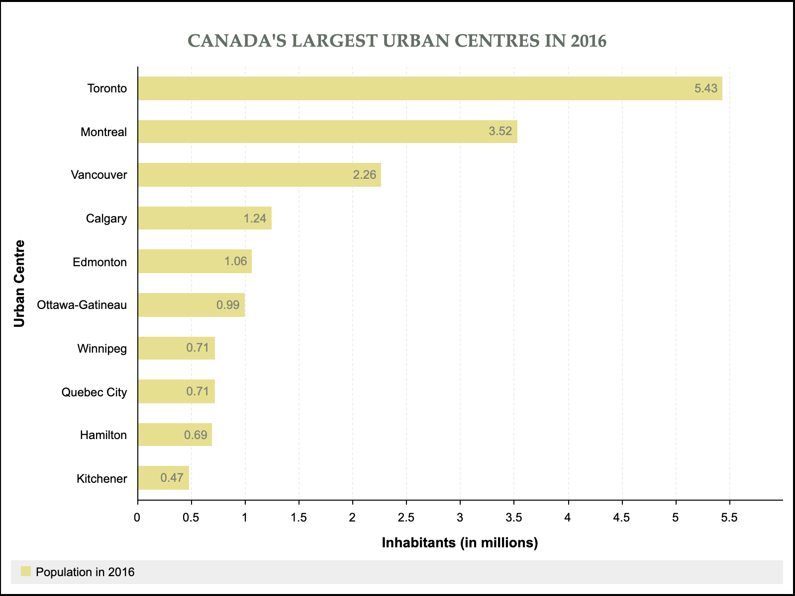

# KevLabs' Bar Chart (KLBC)
KLBC is a web utility for rendering bar charts. It is available in either **vanilla JS or JS with jQuery**.\
This project was completed as stretch work prior to joining Lighthouse Labs' Web Development Bootcamp program.


## Table of contents

* [Features](#features)
* [Examples](#examples)
* [Dependencies](#dependencies)
* [Getting started](#getting-started)


## Features

KLBC comes packaged with a whole lot of customizable options, as listed below:
* Data can be displayed as *horizontal* or *vertical* bars
* Bars can be *stacked* or shown *inline* (side-by-side)
* The y-axis *step* is user-defined (e.g. one tick mark for every 25 units)
* Display and data *base* units are allowed to differ (e.g. data supplied in metres but displayed in kilometres)
* Font styles can be specified at the chart, title and axis levels

Chart data is structured as series of group values where **series** refer to the data values plotted against the y-axis while **groups** are x-axis entities.
> For instances, a chart aiming at capturing how different age groups break up their daily routines between four activities may be structured in the following fashion:
> * Groups: 0-6 years old, 7-17 years old, 18-25 years old, 26-64 years old, 65+ years old
> * Series: work, school, hobbies and sleep
Each series would be made up of 5 data points, one for each group, representing the number of hours spent each day by members of the subject group towards the activity the series relates to.

Scroll below for some examples of charts rendered with the utility.


## Examples

1. Vertical bar chart


2. Vertical stacked bar chart


3. Horizontal bar chart


More examples can be found in the `index.html` (vanilla JS - [Demo](https://kevlabs.github.io/lighthouse-js-barchart/index.html)) and `index-jquery.html` (jQuery - [Demo](https://kevlabs.github.io/lighthouse-js-barchart/index-jquery.html)) files.


## Dependencies

### Vanilla JavaScript version
* none

### jQuery version
* jQuery

The utility is meant to be used within the confines of a browser with **CSS and Javascript (ES6) enabled**.


## Getting Started

### Vanilla JavaScript version
1. Upload `assets/barchart.js` to a directory accessible from your HTML file
2. Reference `barchart.js` in your HTML file
3. Call `drawBarChart()` with the relevant arguments (jump to [Calling the API](#calling-the-api))

### jQuery version
1. Upload `assets/barchart-jquery.js` to a directory accessible from your HTML file
2. Reference the jQuery library in your HTML file (uploaded to a local directory or fetched from a [CDN](https://code.jquery.com))
2. Reference `barchart-jquery.js` in your HTML file
3. Call `drawBarChart()` with the relevant arguments (jump to [Calling the API](#calling-the-api))

### Calling the API
1. Create an empty block element in your HTML file where you would like the bar chart to appear and assign it to a JS variable (`element` in our example).
```
const element = document.querySelector('your element selector');
```

2. Structure your chart data in a JavaScript object, as follows:

```
const data = {
  groups: [number | 'string', number | 'string'...],
  series: [
    {
      label: number | 'string',                       //e.g. 'Series 1'
      data: [number, number...],
      color: '#hex | rgb(, , )',                      //optional - defaults to #000
      backgroundColor: '#hex | rgb(, , )'             //optional - defaults to #DDD
    },
    {
      label: number | 'string',                       //e.g. 'Series 2'
      data: [number, number...],
      color: '#hex | rgb(, , )',                      //optional - defaults to #000
      backgroundColor: '#hex | rgb(, , )'             //optional - defaults to #DDD
    }
  ]
};
```

* Variable types must be respected for the utility to run properly. `''`, `[]` and `{}` denote string, array and object types respectively.
* The length of your `data.groups` and `data.series[].data` arrays must match.
* The `data.series` array may include one or several series.
* **Call `BarChart.validateDataInput(data)` to validate your input format.** This function will log any formatting error to the console or return the `data` object if all tests are passed successfully.

3. Declare chart options in a JS object formatted as below:

```
const options = {
  chart: {
    height: number | 'number px',                           //optional - defaults to 100%
    width: number | 'number px',                            //optional - defaults to 500px
    type: 'inline | stacked',
    direction: 'vertical | horizontal',
    valueVerticalAlignment: 'top | middle | bottom',        //mandatory for vertical charts
    valueHorizontalAlignment: 'left | center | right',      //mandatory for horizontal charts
    font: {                                                 //field is optional and so are its properties
      family: 'string',                                              //defaults to 'Open Sans'
      size: number | 'number px',                                    //defaults to '20px'
      color: '#hex | rgb(, , )',                                     //defaults to '#000'
      weight: number | 'lighter | light | normal | bold | bolder'    //deafults to 300 - if number: multiple of 100 in [100-900]
    }
  },
  title: {
    label: number | 'string',
    verticalAlignment: 'top | bottom',                      //optional - title position: above of below chart
    font: {                                                 //field is optional and so are its properties
      family: 'string',
      size: number | 'number px',                                     //defaults to '20px'
      color: '#hex | rgb(, , )',
      weight: number | 'lighter | light | normal | bold | bolder'     //defaults to 500
    }
  },
  xAxis: {
    label: number | 'string',
    groupSpaceBetween: number | 'number px',                //optional - space between bars
    font: {                                                 //field is optional and so are its properties
      family: 'string',
      size: number | 'number px',                                     //defaults to '14px'
      color: '#hex | rgb(, , )',
      weight: number | 'lighter | light | normal | bold | bolder'     //defaults to 500
    }
  },
  yAxis: {
    label: number | 'string',
    unit: {
      base: number,               //display unit relative to your data (e.g. data in m to be displayed in km -> 1000)
      step: number                //step for y-axis tick marks in the same unit as your data
    },
    font: {                       //field is optional and so are its properties
      family: 'string',
      size: 'number | number px',                                     //defaults to '14px'
      color: '#hex | rgb(, , )',
      weight: number | 'lighter | light | normal | bold | bolder'     //defaults to 500
    }
  }
};
```

* All above `options` properties must exist in your object unless indicated as 'optional'. As a rule of thumb, properties unrelated to styling are mandatory.
* **Call `BarChart.validateOptionsInput(options)` to validate your input format.** This function will log any formatting error to the console or return the `options` object if all tests are passed successfully.

4. Call the API function

Finally call the `drawBarChart` function passing to it the variables `data`, `options` and `element` as arguments.
```
drawBarChart(data, options, element);
```
Note that `element` is a JS `HTMLElement`, not a DOM element id.
